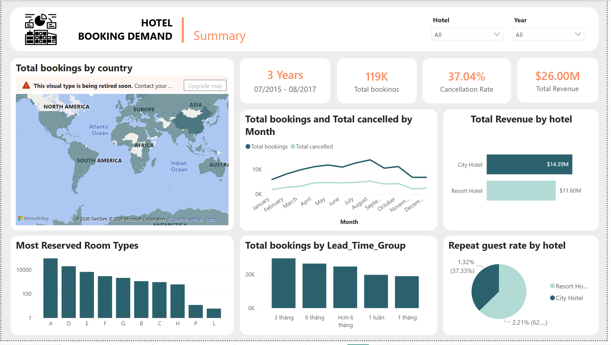
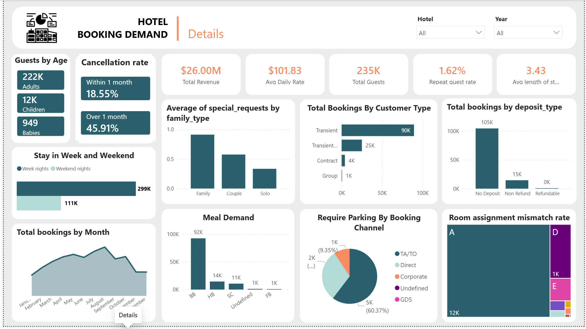
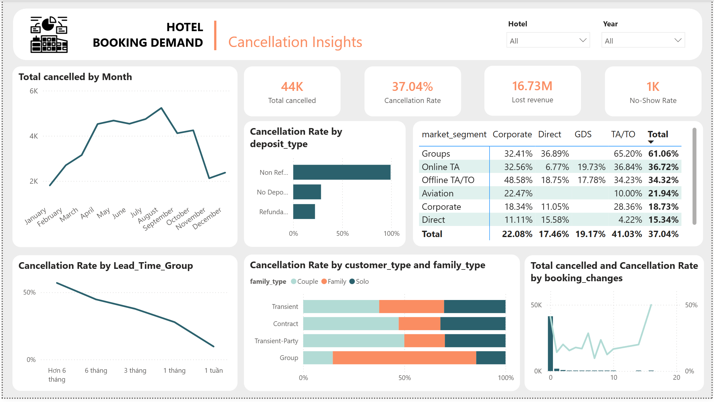
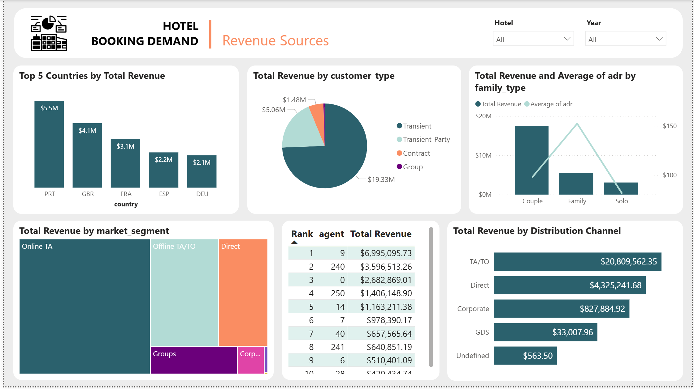

# Power BI Project: Hotel Booking Demand Analytics

Dự án này là phân tích hành vi đặt phòng và dữ liệu vận hành của hai khách sạn tại Bồ Đào Nha (một Khách sạn Thành phố - City Hotel và một Khu nghỉ dưỡng - Resort Hotel) trong giai đoạn từ tháng 7/2015 đến tháng 8/2017. Dashboard được thiết kế dành cho Ban Giám đốc và Quản lý Vận hành nhằm khám phá những insight thực tế về việc tạo ra doanh thu, vẽ chân dung khách hàng và tìm ra nguyên nhân gốc rễ của việc hủy phòng.

## Link dataset
https://www.kaggle.com/datasets/jessemostipak/hotel-booking-demand

## Quy trình dự án
Bước 1: Tiền xử lý (Clean Data) trong Power Query. Các công việc chính bao gồm: tạo Khóa chính (Booking_ID) để định danh đơn hàng, gộp và chuẩn hóa cột ngày tháng (Arrival_Date) để phân tích thời gian, và xử lý các giá trị Null/NA.

Bước 2: Xây dựng Mô hình Star Schema (Chia Dim - Fact). Tách bảng phẳng ban đầu thành Bảng sự kiện trung tâm (FactBookings) và các Bảng danh mục xung quanh (DimHotel, DimCountry, DimMarket, DimBookingInfo, DimDate).

Bước 3: Viết DAX Cốt lõi. Tính toán các KPI xương sống của dự án như: Tổng số đơn đặt (Total Bookings), Tỷ lệ hủy phòng (Cancellation Rate - KPI cực kỳ quan trọng), Tổng số đêm (Total Nights) và Doanh thu ước tính (Total Revenue).

Bước 4: Dựng Dashboard. Báo cáo nên chia thành các trang như: Summary, Details, Cancellation Insight và Revenue Sources

## Dashboard 

### Summary 

### Details

### Cancellation insight

### Revenue sources

